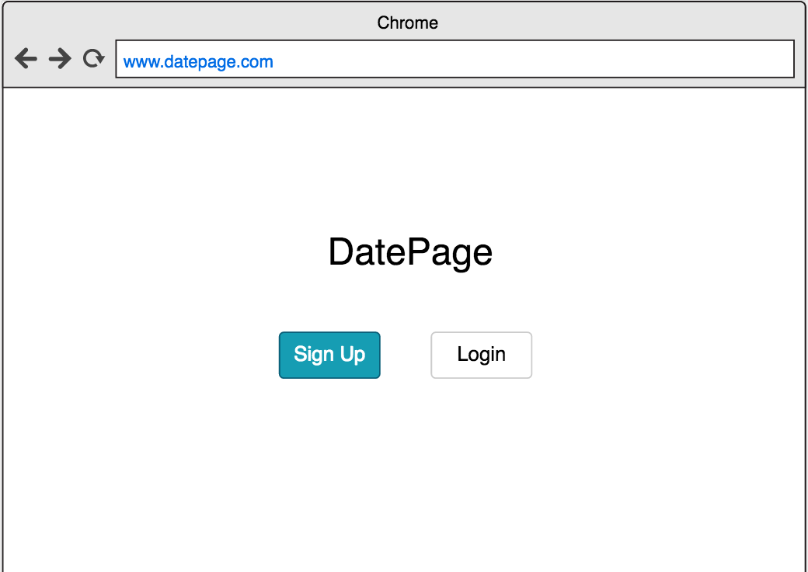
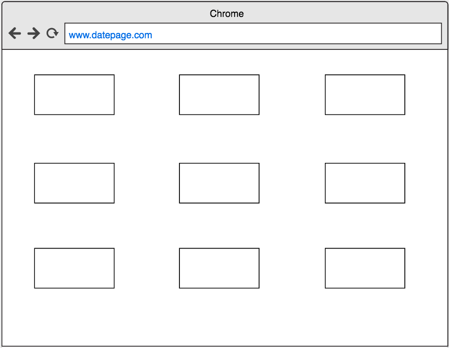

#DatePage

---
##Overview
DatePage is a web app designed to allow users to meet new people on the web and discover whether they have a connection...

##Technologies Used
- Mongo Database, 
- Express,
- Node.js,
- Javascript,
- HTML,
- CSS,
- Bootstrap

##User Stories

| As a ... | I'd like to ... |
| ---------|-----------------|
|User|Login via my local account.|
|User|Be directed to my personal profile where all my f other users' profile picture are displayed in grids.|
|User|Have a "Like" or "Dislike" selection under each picture.|
|User|Be able to receive an email notification when the friend and I both selected "Interesting" on each other's profile picture|

##Installation

Just login at [DatePage](https://shielded-waters-54112.herokuapp.com/) and start using!

##Wireframe

##Future Updates

- Actually implement the Facebook API
- Be able to "like" or "dislike" Facebook friends
- Implement an unlike function
- Better Styling
